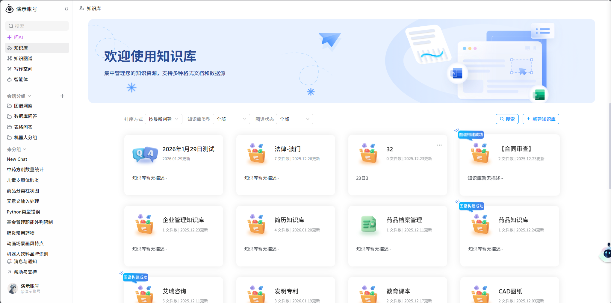
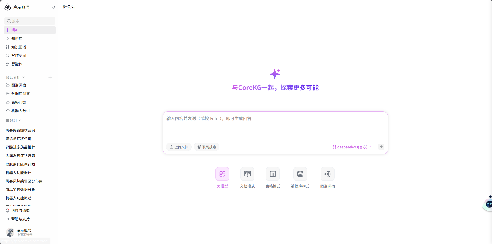
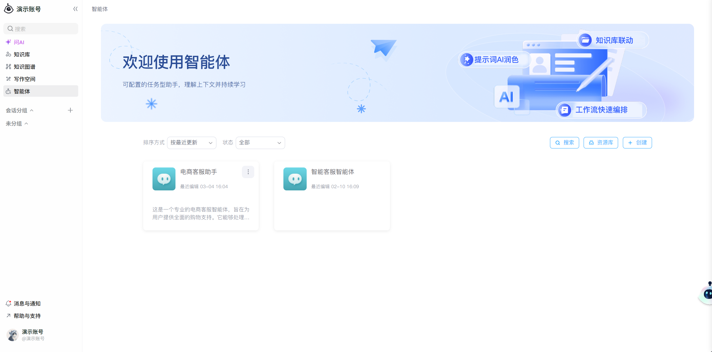
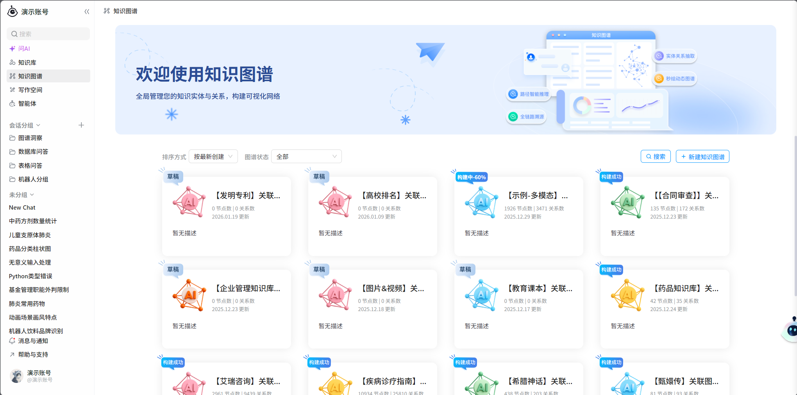
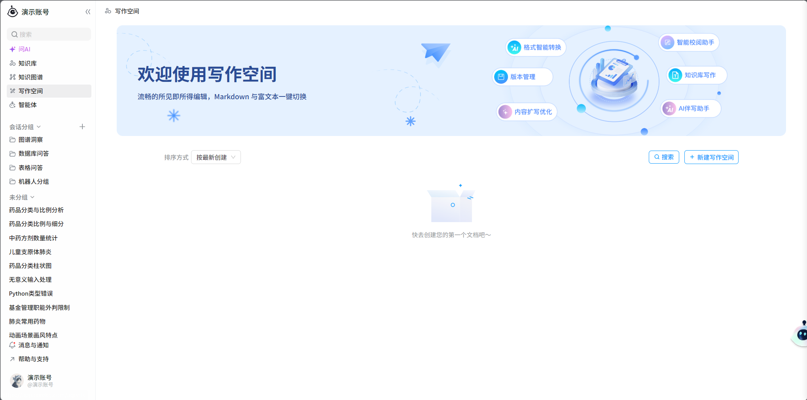

<div align="center">

<!--
  素材说明：
  - badge（license / go / web / protocol-mcp / website）：仓库内置自包含 SVG，见 docs/images/badges/，不依赖外网。
  - logo：docs/images/logo.svg。
  - architecture.png：系统架构图（当前正文用文字分层图代替）。
-->


# CoreKG

开源知识库 / RAG 对话平台 —— 把散落的文档沉淀为**可检索、可对话、可被 Agent 直接调用**的知识资产。

[](./LICENSE)


[](https://corekg.com/)

**目录** · [项目简介](#项目简介) · [界面预览](#界面预览) · [核心特性](#核心特性) · [系统架构](#系统架构) · [快速开始](#快速开始) · [开发指南](#开发指南) · [MCP Server](#mcp-server) · [生态与联动](#生态与联动) · [相关文档](#相关文档) · [贡献指南](#贡献指南) · [社区与支持](#社区与支持) · [许可证](#许可证)

</div>

---

## 项目简介

CoreKG 是一个面向企业与团队的知识平台。它是 [智慧矩阵（insmtx）](https://insmtx.com/)企业 AI 产品矩阵中的**企业知识引擎**（官网：[corekg.com](https://corekg.com/)），并与同矩阵的 **Lework**（企业级 AI 队友 / 数字员工）协同：CoreKG 提供知识供给，Lework 负责任务执行与经验沉淀。

它把**知识库（Forest）**作为承载文档（File）的容器，对多格式文档完成解析与分块后写入检索引擎，并在此基础上提供**基于知识库的对话（Chat）**与**检索（Search）**：

- 上传一份 Word / PDF / Excel / 图片文档，系统自动完成解析 → 拆 chunk → 向量化 → 入库；
- 随后即可对整库文档提问，得到带引用依据的 RAG 回答，也可按知识库范围做语义检索；
- 通过 `keapi` 暴露 **OpenAI 兼容 API** 与 **MCP Server**，AI Agent、客户服务端可以直接把知识库当作自己的"外挂记忆"来调用。

**核心概念**

| 概念 | 说明 |
|---|---|
| Forest / 知识库 | 知识容器，分 file（文档库）与 data（Excel 数据库）两类 |
| File / 文档节点 | 知识库内的文件或目录，支持树形结构组织 |
| Chunk / 分段 | 文档经 RAG 解析后生成的文本块，存储于检索引擎，是检索与问答的基本单元 |
| Chat / Search | 基于知识库的多模式对话与检索能力 |

**技术形态**

- 服务端为 **Go 单体仓库**（module `github.com/insmtx/corekg`，Go 1.24），多应用既可合并为 All-in-One 聚合单体，也可按需拆分为独立服务；
- 文档摄入解析（analyser / chunker / 向量化）由独立的 **Python pipeline** 承担，Office → PDF 预览等任务由异步 worker 完成；
- 知识库异步任务经 **NATS JetStream** 分发；知识图谱基于 Nebula Graph；
- 前端包含 CoreKG Web（知识库 / 问答主界面）与 Workflow Web（智能体工作流编辑器），见 `frontend/`。

## 界面预览

**知识库**（Forest 管理、上传解析、智能分段、原文预览）：

<p align="center"></p>

**知识库问答**（多模式 RAG、可视化画布、原文索引）：

<p align="center"></p>

**智能体**（创建工作流 / 插件 / 提示词模板）：

<p align="center"></p>

**知识图谱**（实体关系可视化、节点详情卡、检索分析、引用溯源）：

<p align="center"></p>

**写作空间**（AI 文档助手、知识库关联与溯源）：

<p align="center"></p>

## 核心特性

### 知识库与文档

| 能力 | 说明 |
|---|---|
| 知识库管理 | Forest 全生命周期管理，file / data 两种库类型，启用 / 禁用 |
| 文档管理 | 上传（去重 / 秒传）、目录树、重命名移动、在线预览、Chunk 查看 |
| 多格式解析 | PDF / Word / Markdown / TXT / HTML / Excel / PPT / 图片等，Office 文件可转 PDF 预览 |
| 摄入管线 | 解析 → 拆 chunk → 向量化 → 写入检索引擎，任务经 NATS JetStream 异步执行，进度可追踪 |
| 知识图谱 | 基于 Nebula Graph 的图谱存储与图谱问答（GraphSearch） |

### 检索与对话

| 能力 | 说明 |
|---|---|
| 混合检索 | Elasticsearch（内置 IK 中文分词）关键词 + 向量混合检索，支持文本 / 文档 / 图片 / 视频分类结果 |
| 8 步 RAG 管线 | QA 精确匹配 → 查询改写 → 向量生成 → 混合检索 → Rerank → 上下文扩展 → 二次 Rerank → 结果组装 |
| 多模式对话 | ForestAgent（ReAct + RAG，默认）、Forest（标准 RAG）、GraphSearch（图谱）、DirectModel（纯 LLM）、Excel（数据分析）等模式按会话路由 |
| 引用溯源 | 问答基于证据生成结构化答案，返回可溯源的引用与上下文 |
| 流式输出 | 内部 Web 流式问答与 OpenAI 兼容 SSE 流式接口 |
| 多模态 | 视觉模型解析图文、图片 / 视频检索（依赖多模态模型配置） |

### 集成与部署

| 能力 | 说明 |
|---|---|
| OpenAI 兼容 API | `keapi` 提供 `/v3` 知识库 REST API（API Key 鉴权）与 `chat/completions` 兼容接口 |
| MCP Server | `keapi` 内置 MCP Server（StreamableHTTP），21 个 Tool 覆盖知识库 / 文档 / 目录 / 对话 / 搜索，详见 [MCP Server](#mcp-server) |
| 智能体工作流 | Workflow 应用基于 NATS 事件总线，前端提供工作流 / Agent 编排界面 |
| 部署形态 | Docker Compose 一键部署；All-in-One 聚合单体与独立微服务两种运行形态 |
| 初始化工具 | `keinit` 一次性完成建表、ES 索引、MinIO bucket、系统设置与模型配置 |
| 统一身份 | `account` 提供账号、组织、API Key 与权限管理，作为全部服务鉴权基础 |

## 系统架构

```
浏览器 / Agent / MCP Client
        │  /v2、/v3（反向代理）
        ▼
前端 CoreKG Web :3001（内嵌 Workflow Web 编辑器）
        ▼
Go 服务层 —— corekg 聚合单体（All-in-One），或按需拆分为独立服务
   · account   身份 / 组织 / 鉴权          · kecore  知识库 / 文档核心域
   · kechat    AI 对话 / 多模式 RAG        · kesearch ES 混合检索
   · keapi     对外 REST API + MCP Server  · ketask / workflow 异步任务与工作流
        │
        ├─▶ 摄入管线（异步任务 · NATS JetStream）
        │       Python pipeline：analyser → chunker → 向量化 → 检索引擎
        │       ketask doc2pdf：Office → PDF 预览
        │
        └─▶ 存储层
                MySQL · Elasticsearch(IK) · Redis · MinIO · Nebula Graph
```

架构图占位：`docs/images/architecture.png`。

- 详细对话与 RAG 流程（API → Service → ChatWrapper 模式路由 → 8 步检索管线 → Eino Agent）见 [docs/core-business-flow.md](docs/core-business-flow.md)；
- 平台分层与演进设计见 [docs/platform-architecture-design.md](docs/platform-architecture-design.md)。

## 快速开始

### 环境要求

- Git
- Docker 与 Docker Compose（推荐的一键部署路径）
- 仅使用宿主开发模式时：Go 1.24+、Python 3（venv）

### 配置约定

所有含密钥 / 连接串的运行配置一律**不入库**，仓库仅提供 `*.example` 模板；使用时复制为真实文件并填写 `change-me` 占位值：

```bash
git clone https://github.com/insmtx/CoreKG.git
cd CoreKG
git config pull.rebase true

# 以 corekg 服务为例（Go 服务模板位于 apps/<app>/conf/<env>/config.yaml.example）
cp apps/corekg/conf/test/config.yaml.example apps/corekg/conf/test/config.yaml
# 编辑 config.yaml，将 change-me 替换为真实值后：
make run APP=corekg ENV=test
```

> keinit 初始化所需补齐的模型地址 / 密钥占位清单见 [docs/local-config-checklist.md](docs/local-config-checklist.md)。

### 方式一：Docker Compose 一键启动（推荐）

```bash
# 1) 补齐运行配置（见上方“配置约定”与初始化清单）
# 2) 首次初始化：建表 / ES 索引 / MinIO bucket / 系统设置（完成后 keinit 正常退出）
docker compose up --build keinit
# 3) 启动 corekg 聚合单体、前端及其依赖（含 pipeline 摄入 worker 等全部服务）
docker compose up -d --build
```

启动完成后：

- 访问主界面 **http://localhost:3001**
- corekg API 位于 **http://localhost:8080**（`/v2`、`/v3` 前缀）
- 健康检查：`curl -fsS http://localhost:3001/healthz`

中间件的端口 / 凭据 / 初始化细节见 [docs/local-development.md](docs/local-development.md)。

### 方式二：宿主开发模式

中间件与业务服务分离运行，适合日常开发调试（宿主机 corekg 与 pipeline worker）：

```bash
make dev-up            # 拉起中间件 + 宿主 corekg + pipeline / doc2pdf worker（见 Makefile）
make dev-up-fe         # （可选）另起前端 Vite dev server :3001
```

> 首次运行前需先完成一次 keinit 初始化（建表 / ES 索引 / 系统设置）。两种启动模式的初始化差异与配置准备见 [docs/local-development.md](docs/local-development.md) 与 [docs/local-config-checklist.md](docs/local-config-checklist.md)。

### 验证安装（知识库闭环）

`scripts/verify/verify-kb.sh` 自动跑通 **登录 → 新建知识库 → 上传文件 → 等待解析（拆 chunk / 向量化 / 入库）→ 基于文件问答** 的完整闭环：

```bash
# 容器模式（docker compose 全量启动后）
./scripts/verify/verify-kb.sh --mode compose --cleanup

# 宿主模式（make dev-up 之后）
./scripts/verify/verify-kb.sh --mode local --cleanup
```

- 样例文件 `testdata/verify_sample.txt`、问题 `testdata/verify_question.txt` 可通过 `--file / --question` 覆盖；
- `--cleanup` 结束后自动删除本次创建的知识库；`VERIFY_PARSE_TIMEOUT` 可调整解析等待时长（默认 180s）。

## 开发指南

### 仓库结构

```
CoreKG/
├── apps/            # Go 应用（每个应用含 cmd/ 入口，可独立构建部署）
├── pkgs/            # 共享库：global 常量/错误码、task/queue/jobs 任务体系、einotools 等
├── clients/         # 独立客户端（如 corekg-cli）
├── frontend/        # Web 前端：corekg（主界面）/ workflow（工作流编辑器）
├── scripts/         # 开发/部署脚本、mysql 迁移、初始化镜像等
├── docs/            # 业务 / 架构 / 部署文档
├── resource/        # 静态资源与 i18n locales
├── version/         # 构建信息（ldflags 注入）
├── docker-compose.yml / Makefile / go.mod
```

### 服务一览

| 应用 | 定位 | 说明 |
|---|---|---|
| `corekg` | 聚合单体（All-in-One） | 将 account / kecore / kechat / keapi / kesearch 等子应用挂载进单进程（默认 `:8080`），一键获得全功能 |
| `account` | 统一身份 | 账号、组织 / 公司管理、登录鉴权、API Key，全部服务的鉴权基础 |
| `kecore` | 核心知识域 | 知识库 / 文档全生命周期、目录树、知识图谱、写作空间、配额 |
| `kechat` | AI 对话 | RAG 多模式问答、Agent 对话、模型管理，驱动知识库 / 图谱 / Excel 等问答场景 |
| `kesearch` | 检索 | Elasticsearch 检索：知识库内搜索、全局搜索、多模态分类结果、Rerank |
| `keapi` | 对外 API | `/v3` 知识库 REST API（API Key 鉴权）+ OpenAI 兼容对话 + MCP Server（默认 `:8086`） |
| `keinit` | 初始化 CLI | 部署时一次性执行：建表、ES 索引、MinIO bucket、系统设置、API Key |
| `ketask` | 异步任务 worker | 消费 JetStream 任务（如 Office → PDF 的 doc2pdf） |
| `workflow` | 工作流 | 智能体工作流引擎，基于 NATS 事件总线，供前端编排 |
| `apps/pipeline` | 文档摄入（Python） | analyser / chunker / 向量化，独立构建体系，经 `make pipeline-<target>` 委派 |
| `apps/*` | 其余子服务 | keapp / websearch / webfetch 等，按需启用 |

各服务职责细节见 `apps/<app>/README.md`。

### 常用命令

```bash
# 构建 / 运行（APP 必传；ENV 默认 test）
make local APP=keapi                # 构建本地二进制 → bundles/keapi
make run APP=corekg ENV=test        # 构建并运行（读 apps/<app>/conf/<env>/config.yaml）
make linux APP=keapi                # 交叉编译 Linux 二进制
make build APP=keapi                # 生成文档 + 二进制
make generate-docs APP=keapi        # 重新生成 swagger 文档（写入 apps/<app>/internal/docs）

# 镜像
make push-image APP=keapi           # 构建并推送镜像（CI 使用）

# 本地环境
make dev-up / dev-down / dev-status # 中间件 + 宿主进程一键启停
make dev-up-fe                      # 前端 Vite dev server

# 测试（注意：多数包级测试依赖真实中间件，建议定向运行）
make test                           # go test -v ./...
go test ./apps/keapi/...            # 定向测试
```

### 约定与注意

- **模块路径**：所有内部 import 使用 `github.com/insmtx/corekg/...` 前缀；
- **vendor**：依赖已 vendor 并入库，构建使用 vendor 模式；改依赖需 `go mod tidy && go mod vendor`；
- **生成文件勿手改**：`apps/*/internal/docs`（swag 生成 swagger）等生成文件不要手动编辑；
- **测试非隔离**：多数测试加载真实配置并连接 MySQL / ES / Redis，请先 `make dev-up` 再运行相关包级测试；
- **数据库迁移脚本规范**：见 [docs/contributing/migration-spec.md](docs/contributing/migration-spec.md)；
- 代码与工程约定（应用分层、路由风格、lint 配置）详见根目录 [AGENTS.md](AGENTS.md)。

## MCP Server

`keapi` 内置 **MCP (Model Context Protocol) Server**，将知识库 API 封装为 21 个 MCP Tool，AI 代理可直接通过标准协议操作知识库。

| 项目 | 说明 |
|---|---|
| Endpoint | `http://<host>:<port>/v3/keapi/mcp`（与 keapi HTTP API 共用端口，默认 `8086`） |
| 传输 / 鉴权 | StreamableHTTP（MCP 2025-03-26）；`Authorization: Bearer <api_key>` |
| Tools | 21 个，分 5 组：知识库管理 / 文档管理 / 目录操作 / 对话 / 搜索 |

完整接入文档（三种客户端接入方式、Tool 列表、curl 验证）见 **[docs/mcp-server.md](docs/mcp-server.md)**。

## 生态与联动

CoreKG 是 [智慧矩阵（insmtx）](https://insmtx.com/)企业 AI 产品矩阵的一员，与同矩阵的其他产品协同，形成从能力供给到业务执行的闭环：

| 产品 | 角色 | 说明 |
|---|---|---|
| **[CoreKG](https://corekg.com/)** | 企业 AI 知识引擎 | 多源知识接入、治理、理解与检索，提供知识问答、知识图谱、引用溯源（本仓库） |
| **[Lework](https://lework.ai/)** | 企业级 AI 队友 / 数字员工 | 以真实项目成员身份接收与执行任务、交付成果，沉淀 Skill 与项目记忆 |
| [CatAPI](https://catapi.insmtx.com/) | AI 能力开放平台 | 通过标准 API 提供文档解析 / OCR / 结构化提取等成熟 AI 能力 |
| [Insmtx Cloud](https://insmtx.com/) | 大模型管理平台 | 模型接入、智能路由、权限与用量管理 |
| [Insmtx 20](https://insmtx.com/all-in-one) | AI 大模型一体机 | 本地 GPU、模型预装、内网运行的私有化算力底座 |

**数据流协同**：`企业数据 → CatAPI / CoreKG（知识与工具能力）→ Lework（任务执行与成果沉淀）→ 项目记忆 / Skill / 企业知识持续回流`。

一言以蔽之：**CoreKG 让企业知识"看得见、找得到、答得准、用得上"，Lework 让这些知识与数字员工一起把任务真正做完**，两者共同构成智慧矩阵的企业智能化闭环。

## 相关文档

| 文档 | 内容 |
|---|---|
| [docs/local-development.md](docs/local-development.md) | 本地基础环境：中间件端口 / 凭据、两种启动模式、初始化 |
| [docs/local-config-checklist.md](docs/local-config-checklist.md) | keinit 初始化所需真实值清单（模型 / 密钥 / 地址） |
| [docs/core-business-flow.md](docs/core-business-flow.md) | 对话 / RAG 核心业务与深层架构 |
| [docs/platform-architecture-design.md](docs/platform-architecture-design.md) | 平台分层与架构演进设计 |
| [docs/pipeline-integration.md](docs/pipeline-integration.md) | 文档摄入（Python pipeline）集成说明 |
| [docs/mcp-server.md](docs/mcp-server.md) | MCP Server 接入指南 |
| [frontend/README.md](frontend/README.md) | 前端开发指南（CoreKG Web / Workflow Web） |
| [corekg.com](https://corekg.com/) | CoreKG 官网（产品能力 / 技术架构 / 私有化方案） |
| [insmtx.com/products](https://insmtx.com/products) | 智慧矩阵产品矩阵（CoreKG · Lework · CatAPI 等） |

## 贡献指南

我们欢迎各种形式的贡献——Issue、文档、代码、使用反馈。

- **提 Issue**：前往 [GitHub Issues](https://github.com/insmtx/CoreKG/issues) 报告缺陷或提出功能建议；
- **提 PR**：Fork 本仓库 → 创建功能分支 → 提交变更 → 发起 Pull Request。建议先开 Issue 讨论设计；
- **开发约定**：动手前请阅读根目录 [AGENTS.md](AGENTS.md)（仓库结构、工程与代码规范）与上方[开发指南](#开发指南)；
- **数据库迁移**：遵循 [docs/contributing/migration-spec.md](docs/contributing/migration-spec.md)（已发布脚本不可修改，通过新版本脚本实现变更）。

## 社区与支持

- 使用问题 / 缺陷报告：[GitHub Issues](https://github.com/insmtx/CoreKG/issues)
- 功能需求与讨论：同上，请带 `feature` / `discussion` 标签发起

## 许可证

CoreKG 依据 **[CoreKG Open Source License](./LICENSE)** 授权：以 Apache License 2.0 为基础，附加若干商业使用条件（英文文本具有法律效力）。涉及多租户 SaaS、知识图谱等特定商业化情形时，需联系维护者取得商业许可，详见 LICENSE 文件。
